# engenharia-dados-tesouro-direto

Este é o trabalho final da disciplina Engenharia de Dados da especialização da PUC: MVP de um
pipeline de dados na nuvem construído no **Databricks Free Edition**, usando o conjunto
de dados público de preços e taxas do Tesouro Direto.

## Sumário

1. [Contexto de Negócios e Perguntas](#1-contexto-de-negócios-e-perguntas)
2. [Carga dos Dados](#2-carga-dos-dados)
3. [Modelagem e Catálogo de Dados](#3-modelagem-e-catálogo-de-dados)
4. [Pipeline de Dados](#4-pipeline-de-dados)
5. [Qualidade de Dados](#5-qualidade-de-dados)
6. [Análise de Dados](#6-análise-de-dados)
7. [Autoavaliação](#7-autoavaliação)

---

## 1. Contexto de Negócios e Perguntas

### 1.1. Problema

O Tesouro Direto é o programa do governo federal para venda de títulos públicos diretamente a pessoas físicas. Investidores frequentemente têm dúvidas sobre qual tipo de título escolher, assim como, como o prazo e o indexador impactam a rentabilidade do título oferecido. Este MVP constrói um pipeline de dados que organiza o histórico de preços e taxas dos títulos do Tesouro Direto para apoiar essa decisão de investimento.

### 1.2. Perguntas de negócio

1. Qual indexador (Selic, IPCA ou Prefixado) historicamente oferece a maior taxa de compra
   média?
2. Como a taxa de rentabilidade oferecida varia conforme o prazo até o vencimento do título (curto, médio ou longo prazo)?
3. Como o Preço Unitário (PU) dos títulos evoluiu ao longo do tempo, comparando os três
   indexadores?
4. Existe diferença de volatilidade do PU entre os indexadores (Selic, IPCA, Prefixado)?
5. Qual título possui o maior histórico de cotações disponível na base?

### 1.3. Contexto dos dados brutos

- **Fonte:** [Tesouro Transparente](https://www.tesourotransparente.gov.br/ckan/dataset/df56aa42-484a-4a59-8184-7676580c81e3/resource/796d2059-14e9-44e3-80c9-2d9e30b405c1/download/precotaxatesourodireto.csv) — arquivo `PrecoTaxaTesouroDireto.csv`.
- **Metadados/dicionário oficial:** [Taxa.pdf](https://www.tesourotransparente.gov.br/ckan/dataset/df56aa42-484a-4a59-8184-7676580c81e3/resource/1a8eb2e3-4902-4a38-a1eb-6410f23d90de/download/taxa.pdf).
- **Formato:** CSV, separador `;`, números com vírgula decimal, datas `dd/mm/aaaa`, dados truncado em duas casas decimais.
- **Estrutura original (colunas):** `Tipo Titulo`, `Data Vencimento`, `Data Base`,
  `Taxa Compra Manha`, `Taxa Venda Manha`, `PU Compra Manha`, `PU Venda Manha`,
  `PU Base Manha`. Uma linha representa a cotação de um título público em uma data
  específica.
- **Licença:** dados abertos do Governo Federal, disponibilizados pelo Tesouro Transparente
  para uso livre, inclusive comercial, com recomendação de citação da fonte. Não há dados
  pessoais ou sensíveis no conjunto (apenas dados de mercado agregados por título).

### 1.4. Definição de Conceitos

- **Título**: um título público emitido pelo Tesouro Nacional, com prazo de vencimento e indexador definidos. Ex.: Tesouro Prefixado 2025, Tesouro IPCA+ 2035, Tesouro Selic 2027.
- **Indexador**: o índice que define a rentabilidade do título. Pode ser Prefixado (taxa fixa), IPCA+ (indexado à inflação) ou Selic (indexado à taxa básica de juros).
- **Data Vencimento**: a data em que o título expira e o investidor recebe o valor corrigido pelo indexador mais a taxa contratada.
- **Data Base**: a data em que a cotação do título foi registrada.

---

## 2. Carga dos Dados

O arquivo CSV foi baixado da fonte oficial e enviado para um **Volume do Unity Catalog**
(`/Volumes/tesouro_direto/bronze/arquivos_brutos`) através da funcionalidade de *Data
Ingestion* / upload de arquivos do Databricks Free Edition. A partir do Volume, o notebook
[`notebooks/01_bronze_ingestao.py`](notebooks/01_bronze_ingestao.py) lê o arquivo e grava a
tabela Delta bruta `tesouro_direto.bronze.preco_taxa_tesouro_direto`, adicionando metadados de
controle (`_ingestion_timestamp`, `_source_file`).
#### Tela de carregamento do arquivo para o Volume.
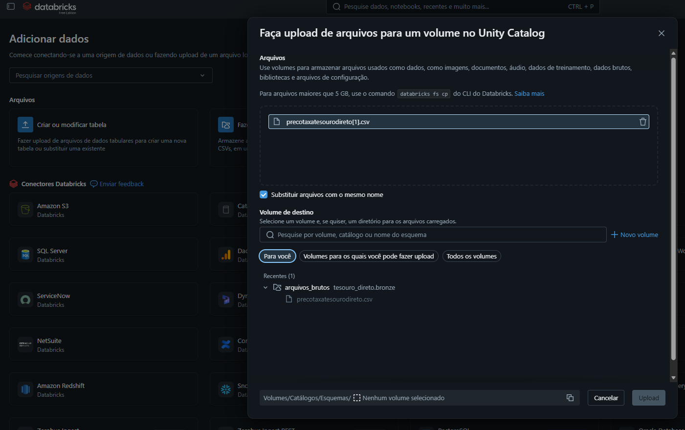

#### Visualização da tabela na camada Bronze
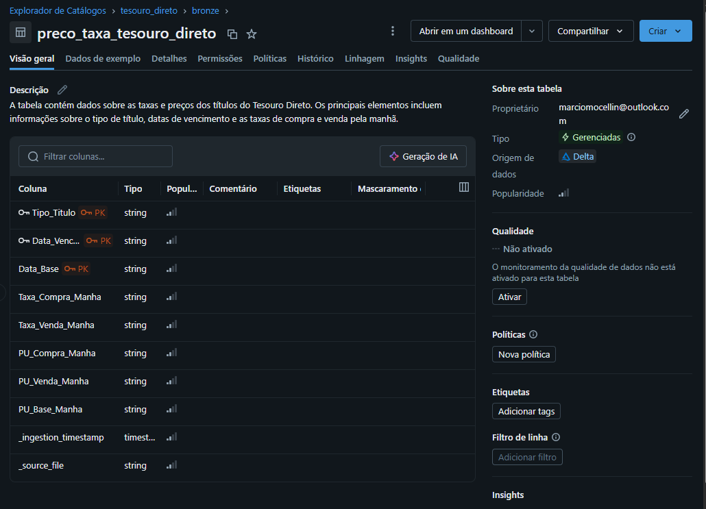

---

## 3. Modelagem e Catálogo de Dados

### 3.1. Modelagem escolhida

Foi adotado o padrão **Arquitetura Medalhão** (Bronze → Silver → Gold), com a camada Gold
modelada em **Esquema Estrela**:

- **Fato:** `gold.fato_cotacao_diaria` — uma linha por cotação diária de um título.
- **Dimensões:** `gold.dim_titulo` (tipo de título e indexador) e `gold.dim_data` (calendário da data base da cotação).

### 3.2. Catálogo de Dados

O catálogo completo, com descrição de cada tabela e cada campo, tipo de dado, domínio de
valores e linhagem, está documentado em [`docs/catalogo_dados.md`](docs/catalogo_dados.md).

#### Tela do Unity Catalog mostrando os catálogos, schemas (`bronze`, `silver`, `gold`) e tabelas criadas.
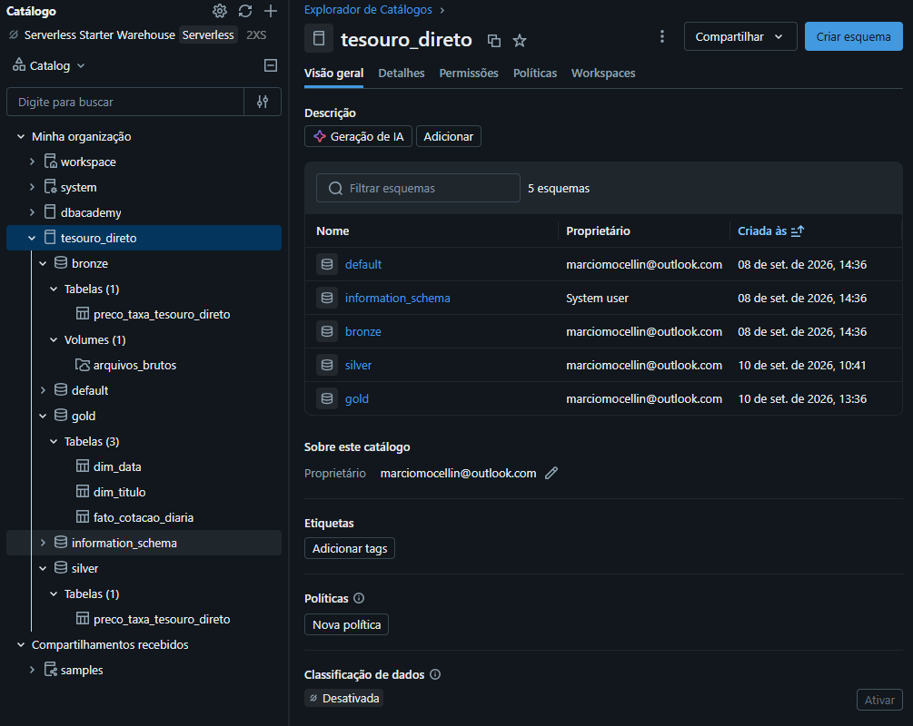

---

## 4. Pipeline de Dados

O pipeline foi dividido em um notebook por etapa de ETL, facilitando manutenção e leitura
independente de cada transformação:

| Notebook | Camada | O que faz |
| --- | --- | --- |
| [`notebooks/01_bronze_ingestao.py`](notebooks/01_bronze_ingestao.py) | Bronze | Lê o CSV bruto do Volume e grava a tabela Delta sem transformações, com metadados de ingestão. |
| [`notebooks/02_silver_limpeza.py`](notebooks/02_silver_limpeza.py) | Silver | Converte tipos (datas e números), remove duplicatas pela chave de negócio e descarta registros inválidos. |
| [`notebooks/03_gold_modelagem.py`](notebooks/03_gold_modelagem.py) | Gold | Cria `dim_titulo`, `dim_data` e `fato_cotacao_diaria` (Esquema Estrela). |
| [`notebooks/04_qualidade_dados.py`](notebooks/04_qualidade_dados.py) | — | Executa as verificações de qualidade descritas na seção 5. |
| [`notebooks/05_analise_perguntas.py`](notebooks/05_analise_perguntas.py) | — | Consultas SQL que respondem às perguntas de negócio da seção 6. |

Cada transformação relevante está comentada diretamente no código do notebook (células
`%md`), explicando o que foi feito, por que foi feito e qual o impacto nos dados — por
exemplo, a conversão de números com vírgula decimal para `decimal(, )` e a remoção de duplicatas pela chave `(tipo_titulo, data_vencimento, data_base)`.

### 4.1. Tabelas prontas (Camada Gold)
#### Dimensão de Data
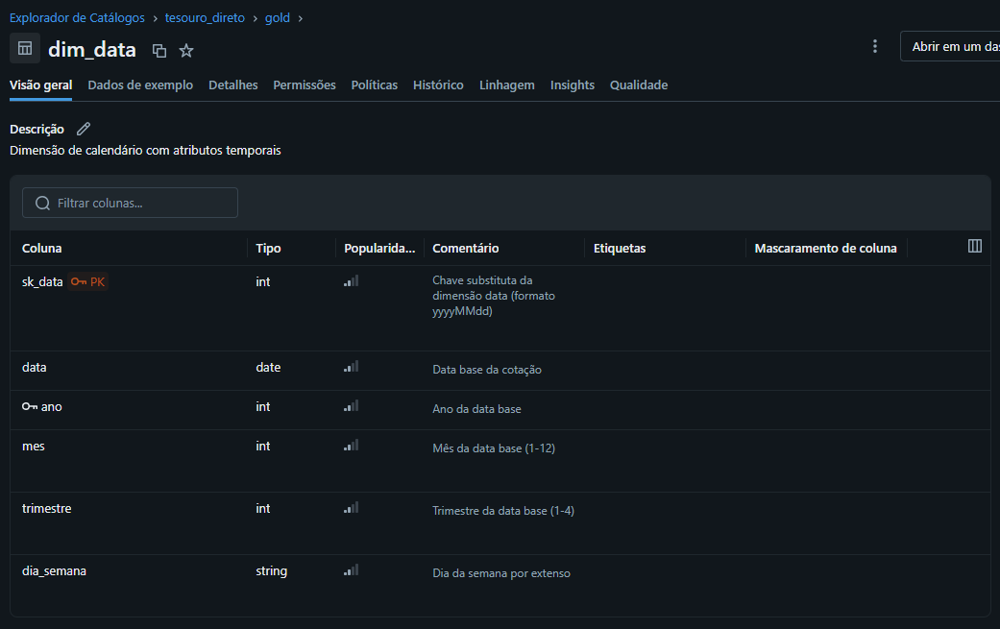

#### Dimensão dos Títulos
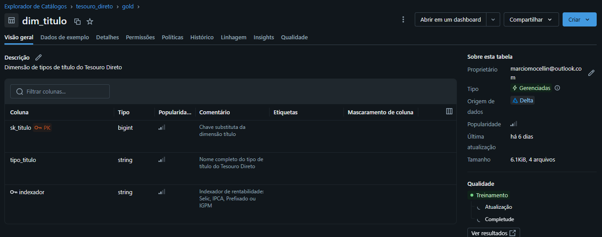

#### Fato da Cotação diária
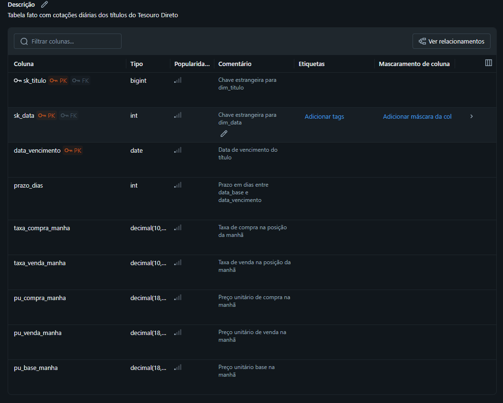

---

## 5. Qualidade de Dados

A verificação de qualidade (notebook [`notebooks/04_qualidade_dados.py`](notebooks/04_qualidade_dados.py))
avaliou os seguintes atributos sobre a camada Bronze:

| Dimensão | Verificação realizada | Problema encontrado | Tratamento aplicado na Silver |
| --- | --- | --- | --- |
| Completude | % de nulos/vazios por coluna | Algumas linhas sem `Taxa Compra/Venda Manha` (dias sem operação de compra/venda de um título) | Mantidas, pois taxa/PU de compra ou venda podem legitimamente não existir em um dia; apenas `pu_base_manha` é obrigatório |
| Consistência | Formato de data (`dd/MM/yyyy`) e de número (vírgula decimal) | Nenhuma inconsistência de formato encontrada na amostra validada | Conversão explícita de tipo (`to_date`, `regexp_replace` + `cast`) como salvaguarda |
| Unicidade | Duplicatas pela chave `(tipo_titulo, data_vencimento, data_base)` | Poucas linhas duplicadas identificadas | `dropDuplicates` na chave de negócio |
| Acurácia | `pu_base_manha` deve ser positivo | Registros nulos ou com `pu_base_manha` <= 0 | Linhas descartadas via filtro |
| Outliers | PU fora de 3 desvios padrão da média por indexador | Oscilações pontuais de mercado observadas, dentro do esperado para títulos de renda variável indexados a preços | Mantidos (não são erro de dados, refletem o mercado); apenas monitorados |

Todos os critérios acima e as contagens de linhas afetadas são impressos como saída do
próprio notebook de qualidade, servindo para possíveis auditorias e correções.

---

## 6. Análise de Dados

As consultas que respondem a cada pergunta estão no notebook
[`notebooks/05_analise_perguntas.py`](notebooks/05_analise_perguntas.py), rodando sobre a
camada Gold. Resultados obtidos na execução no Databricks Free Edition:

1. **Indexador com maior taxa de compra média:** o **Prefixado** apresenta a maior taxa de
   compra média (11,55%), seguido pelo IGPM (6,52%), IPCA (6,21%) e Selic (0,03%). A taxa
   do Tesouro Selic é próxima de zero porque representa o prêmio (spread) sobre a taxa
   básica, que é quase nulo em condições normais de mercado. Os títulos Prefixados e IPCA+
   confirmam a expectativa de taxas mais altas por incorporarem prêmio de risco por prazo e
   exposição à inflação/juro fixo.

   | Indexador | Taxa de compra média (%) | Qtd. cotações |
   | --- | --- | --- |
   | Prefixado | 11,55 | 55.291 |
   | IGPM | 6,52 | 15.786 |
   | IPCA | 6,21 | 83.434 |
   | Selic | 0,03 | 21.357 |

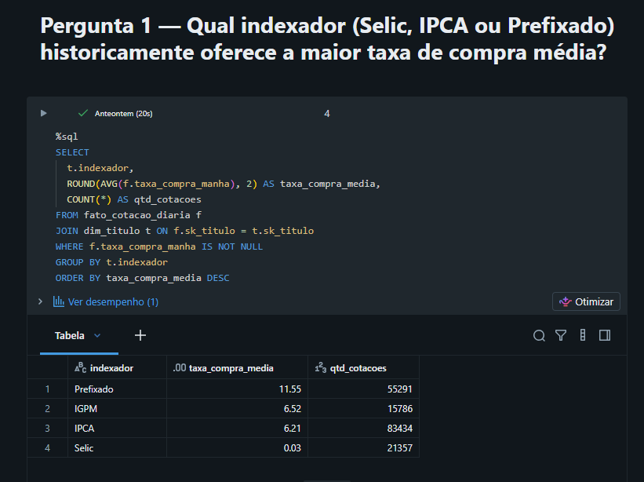

2. **Taxa por faixa de prazo:** contrariando a expectativa inicial de relação positiva
   entre prazo e taxa, o **curto prazo** apresentou a maior taxa média (7,98%), seguido do
   **longo prazo** (6,99%) e do **médio prazo** (6,74%). Esse resultado reflete a composição
   dos indexadores em cada faixa: títulos de curto prazo incluem uma proporção maior de
   Prefixados (taxa média elevada), enquanto o médio prazo concentra títulos Selic e IPCA
   com taxas mais baixas.

   | Faixa de prazo | Taxa de compra média (%) |
   | --- | --- |
   | Curto prazo (≤ 2 anos) | 7,98 |
   | Longo prazo (> 5 anos) | 6,99 |
   | Médio prazo (2 a 5 anos) | 6,74 |

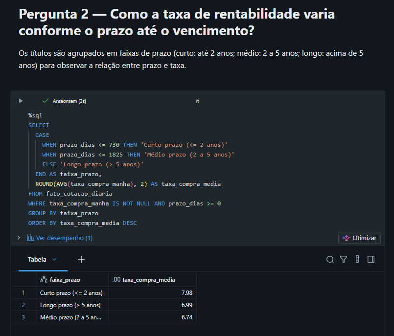

3. **Evolução do PU por indexador:** o PU médio dos títulos **Selic** cresce de forma
   acentuada e quase monotônica ao longo do período (de ~R$ 2.144 em 2004 a ~R$ 18.886 em
   2026), refletindo o acúmulo de juros pós-fixados. O **IGPM** também apresenta crescimento
   expressivo (de ~R$ 1.792 a ~R$ 7.636). O **IPCA** sobe de forma moderada (de ~R$ 1.231 a
   ~R$ 2.450) e o **Prefixado** permanece relativamente estável em torno de R$ 800–1.000,
   pois títulos prefixados são emitidos próximos ao par e convergem ao valor de face no
   vencimento.

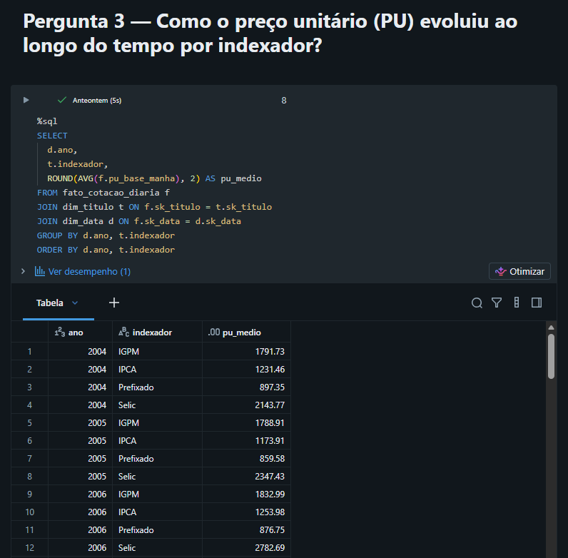

4. **Volatilidade do PU:** o **Selic** apresenta o maior desvio padrão do PU (4.889,95),
   seguido pelo IGPM (2.071,05), IPCA (1.178,35) e Prefixado (144,09). Esse resultado
   contraria a expectativa inicial — a elevada dispersão do Selic decorre do acúmulo
   contínuo de juros ao longo de mais de 20 anos, que amplia a amplitude dos valores de PU
   na série histórica, e não de instabilidade de mercado. O Prefixado, por convergir ao
   valor de face, apresenta a menor volatilidade.

   | Indexador | Desvio padrão do PU | PU médio |
   | --- | --- | --- |
   | Selic | 4.889,95 | 7.930,35 |
   | IGPM | 2.071,05 | 3.582,95 |
   | IPCA | 1.178,35 | 2.340,22 |
   | Prefixado | 144,09 | 893,30 |

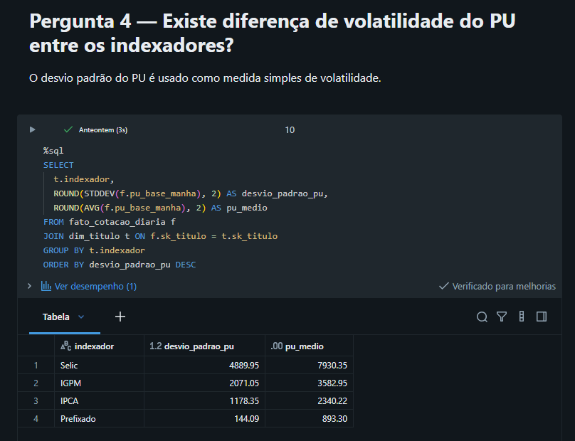

5. **Título com maior histórico:** o **Tesouro IPCA+ com Juros Semestrais** possui o maior
   número de cotações (43.884), com registros de 31/12/2004 a 04/09/2026, indicando ser o
   título mais consistentemente ofertado no período coberto pela base.

   | Tipo de título | Qtd. cotações | Primeira cotação | Última cotação |
   | --- | --- | --- | --- |
   | Tesouro IPCA+ com Juros Semestrais | 43.884 | 2004-12-31 | 2026-09-04 |
   | Tesouro Prefixado | 28.080 | 2004-12-31 | 2026-09-04 |
   | Tesouro Prefixado com Juros Semestrais | 27.211 | 2004-12-31 | 2026-09-04 |
   | Tesouro Selic | 21.357 | 2004-12-31 | 2026-09-04 |
   | Tesouro IPCA+ | 18.780 | 2005-07-18 | 2026-09-04 |

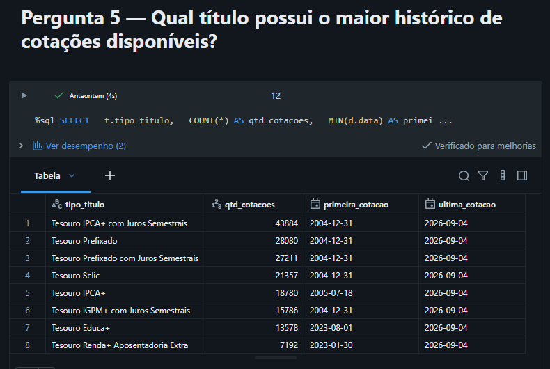

---

## 7. Autoavaliação

Este MVP entrega o ciclo completo de um pipeline de dados na nuvem: definição de objetivo,
coleta para um Volume do Unity Catalog, modelagem em Esquema Estrela documentada em um
catálogo de dados, pipeline de ETL dividido em notebooks Bronze/Silver/Gold, análise de
qualidade e análise que respondem às perguntas de negócio propostas.

O meu objetivo com esse MVP era demonstrar a minha capacidade de construir um pipeline de dados completo,
por isso escolhi trabalhar com um conjunto de dados conhecido e relativamente simples. Eu já havia utilisado
os dados do Tesouro Direto as outras sprints desse curso, então pude estruturar as perguntas de negócio de
forma a explorar diferentes aspectos da engenharia de dados, como forma de praticar os conteúdos aprendidos.

**O que foi atingido:** Pratiquei e desemvolvi os conhecimentos adiquiridos durante essa sprint e isso me
permitiu responder todas as cinco perguntas propostas, com consultas implementadas sobre a camada Gold.
Além disso, criei rotinas para poder observar os principais problemas de qualidade de dados esperados
para este conjunto (duplicatas, tipos como texto, valores nulos) foram tratados na camada
Silver.

**Dificuldades e limitações:** O unico problema foi não haver acesso direto a internet em um
workspace do **Databricks Free Edition** neste. Isso não permitiu que eu automatizasse a ingestão
de dados do Tesouro Direto, então tive que baixar o arquivo manualmente e fazer o upload para o Volume.
O que foi meio frustrante, pois consegui automatizar a ingestão de dados em outros MVP's dessa pós-graduação.

**Trabalhos futuros:** Pretendo explorar as ferramentas de machine learning do Databricks para tentar prever a taxa
de compra de um título com base em seu indexador e prazo até o vencimento, assim como explorar a utilização de LLM's e embaddings desse ambiente.
